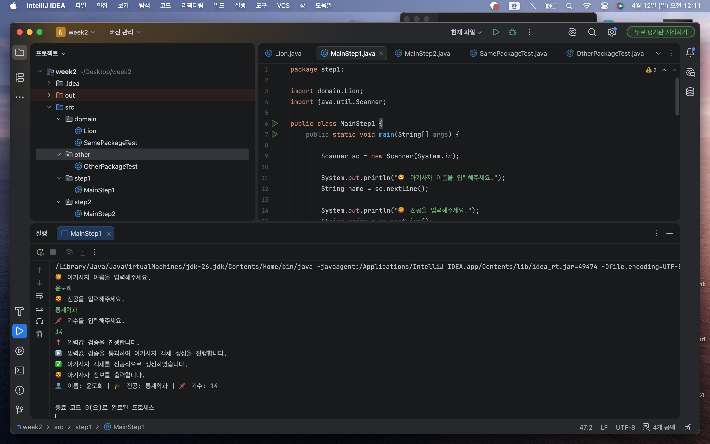
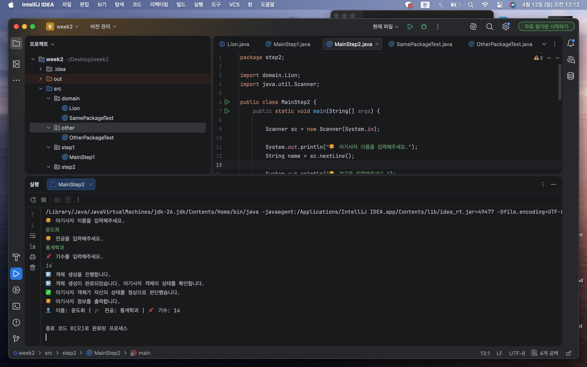

# 📘 Today I Learned

### 1. 오늘 배운 내용
공부 날짜: 26.04.12

객체지향 프로그래밍에서 중요한 개념인 캡슐화와 책임 분리를 중심으로 학습하였다. 
아기사자 정보를 객체로 관리하는 프로그램을 구현하는 과정을 통해, 단순히 데이터를 저장하는 것을 넘어 객체가 어떤 역할을 수행해야 하는지에 대해 고민해보는 것이 목표였다. 
특히 데이터를 변수로 관리할 경우 코드가 여러 곳에 흩어지게 되는 문제, 입력값 검증을 어디에서 수행하느냐에 따라 프로그램 구조가 달라지는 문제, 
그리고 접근 제어자의 역할이 직관적으로 이해되지 않는 점을 중심으로 실습을 진행하였다.

---

### 2. 핵심 정리 (내 언어로)

### Step1
입력값 검증을 main 메서드에서 직접 수행

전체 흐름: 입력 → 검증 → 객체 생성

(문제점) main이 너무 많은 역할을 담당 (입력 + 검증 + 생성), 코드의 책임이 분리되지 않음

### Step2
객체가 자신의 상태를 스스로 검증

main은 전체 흐름 제어만 담당

### Step3
접근 제어자를 바꿔가며 클래스 간 접근 가능 여부를 확인

public → 모든 패키지에서 접근 가능

default → 같은 패키지에서만 접근 가능

private → 해당 클래스 내부에서만 접근 가능

---

### 3. 결과 이미지

---

### 4. 느낀 점
이번 실습을 통해 객체는 단순히 데이터를 저장하는 구조가 아니라, 자신의 상태를 스스로 관리하고 책임을 수행하는 주체라는 점을 깊이 이해하게 되었다. 
특히 검증 로직을 객체 내부로 이동시키는 것이 더 자연스럽고 안정적인 구조라는 점이 인상적이었다. 
또한 접근 제어자를 활용하면 객체의 내부 상태를 보호하면서도 필요한 범위에서만 기능을 제공할 수 있다는 점을 체감하였다. 
이러한 경험을 통해 객체지향 프로그래밍의 핵심은 데이터와 그 데이터를 다루는 책임을 하나로 묶는 것이라는 점을 명확하게 이해할 수 있었다.

