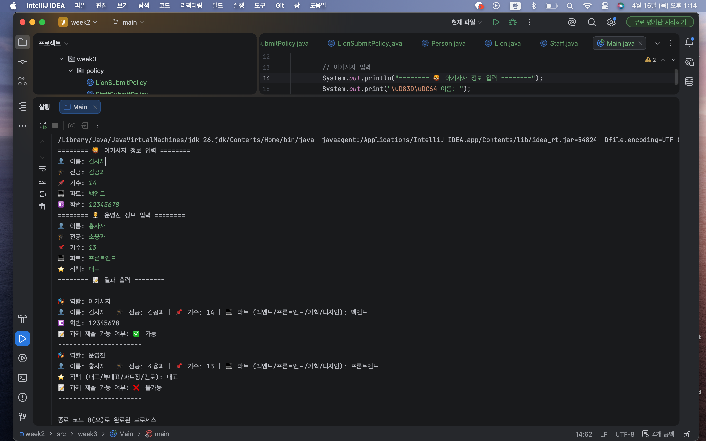

# 📘 Today I Learned

### 1. 오늘 배운 내용

공부 날짜: 26.4.16

이번 주차에서는 단순한 조건문 대신 객체지향 설계를 통해 역할별 행동을 처리하는 방법을 배웠다.
특히 상속, 추상 클래스, 인터페이스, 다형성을 활용하여 역할에 따른 과제 제출 가능 여부를 구조적으로 구현했다.

기존에는 역할을 문자열로 구분하여 조건문으로 처리했지만, 이번에는 각 객체가 자신의 역할에 맞는 판단을 직접 수행하도록 설계하였다.
이를 위해 공통 속성을 가지는 추상 클래스와, 역할별 정책을 정의하는 인터페이스를 분리하여 구현했다.

---

### 2. 핵심 정리 (내 언어로)

* Person이라는 추상 클래스를 만들어 공통 속성을 관리했다.
* Lion과 Staff는 이를 상속받아 각각 다른 역할을 가지도록 했다.
* 과제 제출 가능 여부는 SubmitPolicy 인터페이스로 분리했다.
* Lion과 Staff는 각각 다른 정책 객체를 반환하도록 구현했다.
* Main에서는 Person 타입으로 객체를 받아, 어떤 객체인지 신경 쓰지 않고 동일하게 처리했다.

즉, Main은 시키기만 하고, 실제 판단은 각 객체가 내부에서 처리하는 구조였다.

---

### 3. 결과 이미지

---

### 4. 느낀 점

처음에는 조건문으로 처리하는 게 더 직관적이라고 느꼈지만, 역할이 늘어날수록 코드가 복잡해질 수 있다는 걸 깨달았다.
객체지향 방식으로 설계하니까 코드가 더 구조적이고 확장에 유리하다는 점이 인상적이었다.

특히 누가 판단해야 하는가를 고민하는 과정이 중요하다는 걸 느꼈고,
단순히 기능 구현이 아니라 설계 관점에서 생각해야 한다는 점이 새로웠다.

아직은 추상 클래스와 인터페이스를 자연스럽게 사용하는 게 익숙하지 않지만,
이런 구조를 반복해서 연습하면 점점 익숙해질 것 같다.
