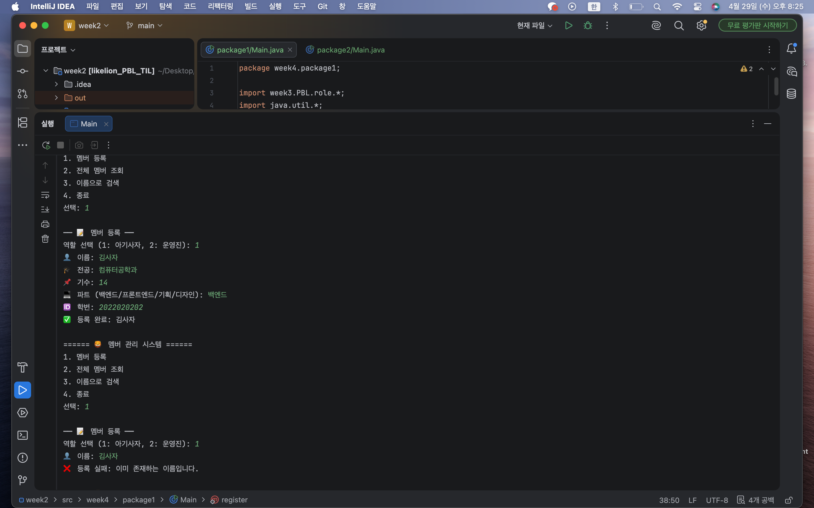
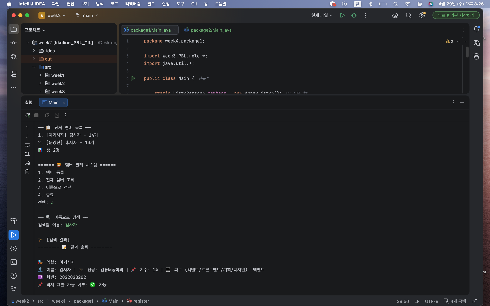
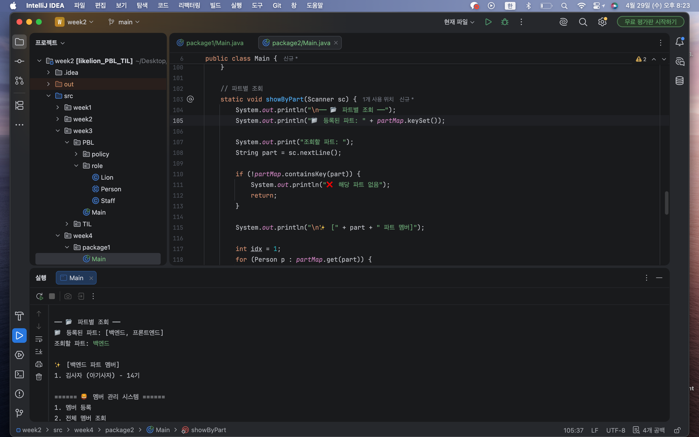

# 📘 Today I Learned

### 1. 오늘 배운 내용

공부 날짜: 26.4.29

이번 주차에서는 이전 주차에서 설계한 객체지향 구조를 유지하면서, Java 컬렉션(List, Map)을 활용해 여러 멤버를 효율적으로 관리하는 방법을 배웠다.  
단순히 하나의 객체를 다루는 것이 아니라, 여러 객체를 저장하고 검색하고, 특정 기준(파트)에 따라 그룹화하는 기능을 구현했다.

List를 사용하여 전체 멤버를 저장하고, 이름으로 검색하거나 전체 조회를 수행했으며,  
Map을 추가로 사용하여 파트별로 멤버를 묶어서 관리하는 구조를 설계했다.

특히 기존에 구현했던 Person, Lion, Staff, SubmitPolicy 구조를 수정하지 않고 그대로 재사용하면서 기능을 확장했다는 점이 중요했다.

---

### 2. 핵심 정리 (내 언어로)

* List<Person>을 사용해 모든 멤버를 저장하고 관리했다.
* 이름 중복을 방지하기 위해 등록 시 List를 순회하며 검사했다.
* Map<String, List<Person>>을 사용해 파트별로 멤버를 그룹화했다.
* 멤버를 등록할 때 List뿐 아니라 Map에도 동시에 추가하도록 구현했다.
* 특정 파트를 기준으로 빠르게 멤버를 조회할 수 있었다.
* 기존 객체지향 구조(Person, Lion, Staff)는 수정하지 않고 그대로 활용했다.

즉, 객체는 그대로 두고, 컬렉션을 통해 관리 방식을 확장한 구조였다.

---

### 3. 결과 이미지

---

### 4. 느낀 점

이번 주차에서는 단순히 기능을 구현하는 것을 넘어서, 이미 만들어진 구조를 어떻게 확장할 수 있는지를 고민하게 되었다.  
특히 기존 코드를 수정하지 않고 재사용하는 방식이 인상적이었고, 객체지향 설계의 장점을 직접 체감할 수 있었다.

List와 Map을 함께 사용하면서 데이터 관리 방식이 훨씬 효율적으로 바뀌었고,  
단순한 배열보다 훨씬 유연하게 데이터를 다룰 수 있다는 점을 느꼈다.

또한 입력 처리 과정에서 예외가 발생하는 경험을 통해, 사용자 입력을 안전하게 처리하는 것의 중요성도 알게 되었다.

아직 컬렉션을 완전히 자유롭게 다루지는 못하지만,  
이번 과제를 통해 객체지향 설계 위에 자료구조를 결합하는 흐름을 이해할 수 있었고,  
앞으로 더 복잡한 프로그램을 구현할 때 도움이 될 것 같다.