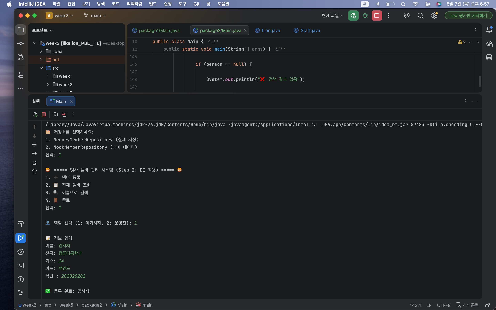
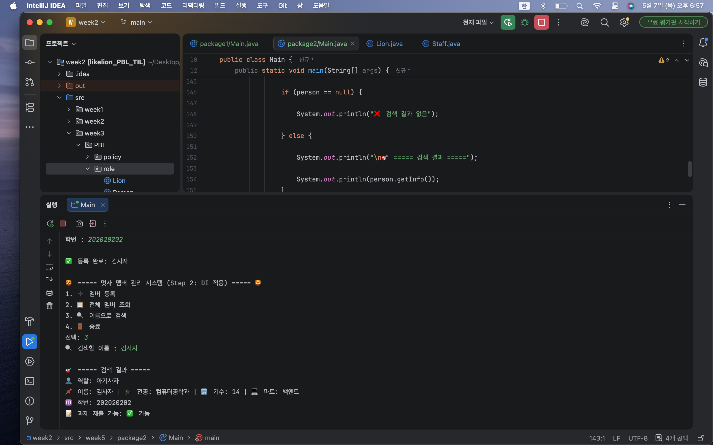

# 📘 Today I Learned

### 1. 오늘 배운 내용

공부 날짜: 26.5.7

이번 주차에서는 기존 멤버 관리 시스템을 리팩토링하면서, 객체 간 의존성을 줄이는 방법인 DI(Dependency Injection, 의존성 주입)와 IoC(Inversion of Control, 제어의 역전)를 학습했다.

이전 구조에서는 Service 클래스 내부에서 Repository 객체를 직접 생성했기 때문에 특정 구현체에 강하게 의존하는 구조였다.
하지만 이번에는 Repository를 인터페이스로 추상화하고, 생성자를 통해 외부에서 구현체를 주입받는 방식으로 변경했다.
또한 MemoryMemberRepository와 MockMemberRepository 두 가지 구현체를 만들어 같은 Service 코드에서도 저장소 구현체만 교체하여 서로 다른 동작을 수행하도록 구현했다.

이를 통해 객체를 직접 생성하는 구조와 인터페이스 기반 설계의 차이를 비교하며, 왜 Spring에서 DI를 사용하는지 구조적으로 이해할 수 있었다.

---

### 2. 핵심 정리 (내 언어로)

* 기존에는 Service 내부에서 Repository 객체를 직접 생성했다.
* 직접 생성 방식은 특정 구현체에 강하게 의존하는 구조였다.
* Repository를 인터페이스로 분리하여 추상화했다.
* MemoryMemberRepository와 MockMemberRepository 두 개의 구현체를 만들었다.
* Service는 구현체가 아닌 인터페이스에만 의존하도록 변경했다.
* 생성자를 통해 Repository를 외부에서 주입받는 방식(DI)을 적용했다.
* Main에서 구현체만 교체하면 Service 코드는 수정하지 않아도 동작이 달라졌다.
* final 키워드를 사용하여 Repository가 한 번만 설정되도록 구성했다.

즉, 객체를 직접 생성하지 않고 외부에서 주입받도록 변경하면서 결합도를 낮추고 확장 가능한 구조로 개선한 것이 핵심이었다.

---

### 3. 결과 이미지

---

### 4. 느낀 점

이번 주차에서는 단순히 기능을 구현하는 것보다 “구조를 어떻게 설계해야 유지보수가 쉬워지는가”를 많이 고민하게 되었다.

처음에는 Repository를 직접 생성하는 방식이 더 간단해 보였지만, 구현체를 변경할 때마다 Service 코드까지 수정해야 한다는 문제가 있었다.
반면 DI를 적용한 이후에는 Main에서 어떤 구현체를 주입하느냐에 따라 동작이 달라졌고, Service는 수정하지 않아도 되었다.

특히 인터페이스에 의존하는 구조가 왜 유연한 설계라고 불리는지 직접 체감할 수 있었다.
또한 MockRepository를 사용해 테스트용 데이터를 쉽게 교체할 수 있다는 점도 인상적이었다.

이번 과제를 통해 단순히 코드를 작성하는 것을 넘어서, 객체 간 관계를 어떻게 설계해야 하는지를 배우게 되었고,
이 구조가 이후 Spring Framework의 DI 컨테이너와 연결된다는 점도 이해할 수 있었다.

아직 IoC와 DI 개념이 완전히 익숙하지는 않지만,
이번 실습을 통해 객체지향 설계에서 결합도를 낮추는 방식과 인터페이스 기반 설계의 중요성을 경험할 수 있었다.
