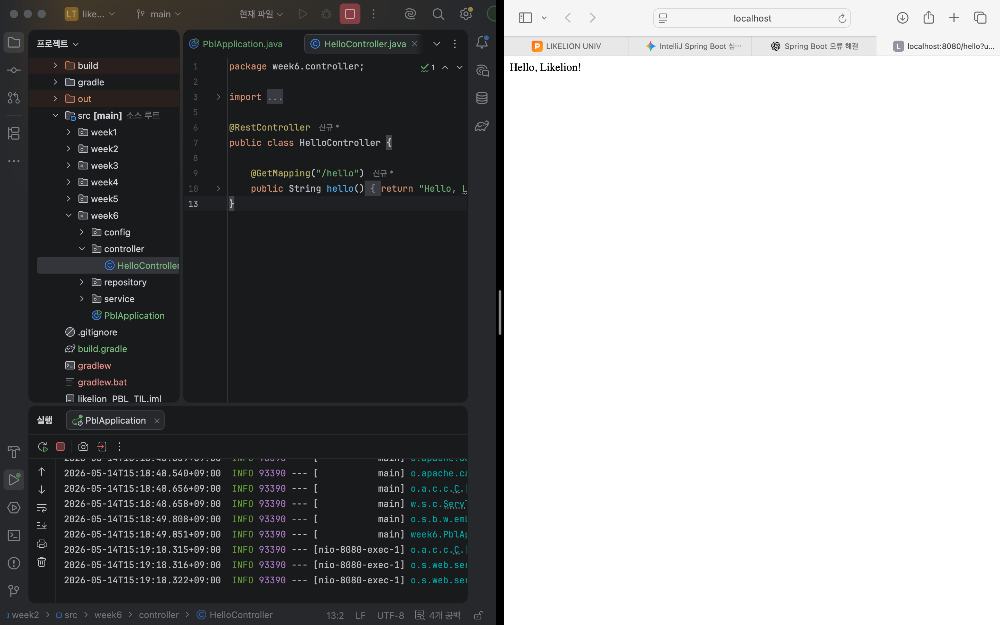
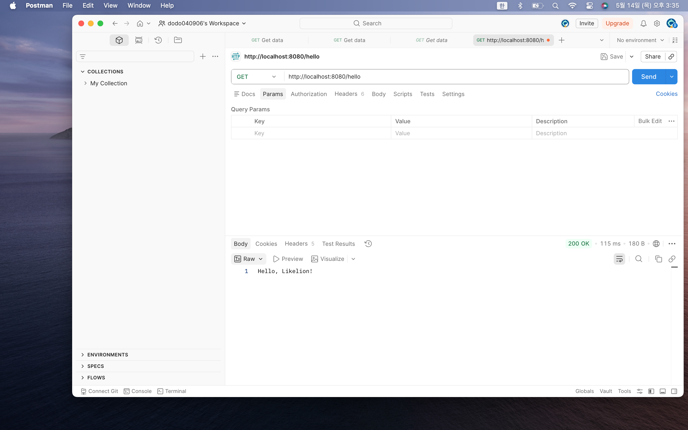

# 📘 Today I Learned

### 1. 오늘 배운 내용

공부 날짜: 26.5.14

이번 주차에서는 Spring Boot 프로젝트를 직접 실행하고, REST API의 기본 구조를 구현하는 실습을 진행했다.

처음에는 Spring Boot 프로젝트 구조와 실행 환경을 설정하는 과정에서 많은 오류를 겪었는데, 특히 Gradle과 Source Root 설정, 그리고 패키지 구조가 중요한 역할을 한다는 점을 알게 되었다.

기존에는 단순히 Java 파일만 실행해 보았다면, 이번에는 Spring Boot Application을 통해 내장 Tomcat 서버를 실행하고, HTTP 요청을 처리하는 Controller를 직접 작성했다.

또한 `@RestController`, `@GetMapping` 어노테이션을 활용해 특정 URL 요청에 문자열 응답을 반환하는 API를 구현했다.
브라우저뿐만 아니라 Postman 같은 API 클라이언트를 사용하여 직접 HTTP 요청을 보내고 응답을 확인하는 과정도 함께 실습했다.

이를 통해 Spring Boot가 단순한 Java 프로그램이 아니라 웹 서버와 API를 쉽게 개발할 수 있도록 도와주는 프레임워크라는 점을 체감할 수 있었다.

---

### 2. 핵심 정리 (내 언어로)

* Spring Boot 프로젝트는 기본적인 패키지 구조가 중요하다.
* `PblApplication` 클래스는 Spring Boot 애플리케이션의 시작점 역할을 한다.
* `@SpringBootApplication` 어노테이션을 통해 Spring Boot가 실행된다.
* Gradle을 통해 프로젝트 의존성과 실행 환경을 관리한다.
* Source Root 설정이 잘못되면 패키지를 정상적으로 인식하지 못할 수 있다.
* Spring Boot 실행 시 내장 Tomcat 서버가 함께 실행된다.
* `@RestController`를 사용하면 HTTP 요청을 처리하는 Controller를 만들 수 있다.
* `@GetMapping("/hello")`을 통해 특정 URL 요청을 처리할 수 있다.
* 브라우저에서 `localhost:8080/hello`로 접속하면 API 응답 결과를 확인할 수 있다.
* Postman을 사용하면 GET 요청뿐 아니라 다양한 HTTP 요청도 테스트할 수 있다.

즉, 이번 실습의 핵심은 Spring Boot 프로젝트를 직접 실행하고, Controller를 활용해 간단한 REST API를 구현하며 웹 서버 동작 구조를 이해하는 것이었다.

---

### 3. 결과 이미지

---

### 4. 느낀 점

이번 주차에서는 단순히 Java 코드를 작성하는 것을 넘어, 실제 웹 서버가 어떻게 실행되는지를 직접 경험할 수 있었다.

처음에는 Source Root 설정이나 패키지 구조 때문에 계속 오류가 발생해서 많이 헷갈렸지만, Spring Boot가 정해진 프로젝트 구조를 기반으로 동작한다는 점을 이해한 이후에는 왜 이런 설정이 중요한지 알 수 있었다.

특히 서버 실행 로그에서 Tomcat이 실행되고 포트가 열리는 과정을 보면서, 내가 작성한 코드가 실제 웹 애플리케이션으로 동작하고 있다는 점이 신기하게 느껴졌다.

또한 Controller를 통해 URL 요청을 처리하고, 브라우저나 Postman에서 직접 응답을 확인하는 과정이 인상적이었다.
이전까지는 단순히 콘솔 출력 중심으로 프로그램을 작성했다면, 이제는 HTTP 요청과 응답이라는 웹 기반 구조로 프로그램이 동작한다는 차이를 체감할 수 있었다.

이번 실습을 통해 Spring Boot의 기본 구조와 실행 흐름을 이해할 수 있었고,
앞으로는 단순한 문자열 반환을 넘어서 JSON 데이터 처리나 CRUD API 구현까지 확장할 수 있을 것 같다는 기대가 생겼다.

아직 Spring Boot의 전체 구조가 완전히 익숙하지는 않지만,
이번 실습을 통해 웹 백엔드 개발의 기본 흐름과 API 동작 방식을 직접 경험할 수 있었다.