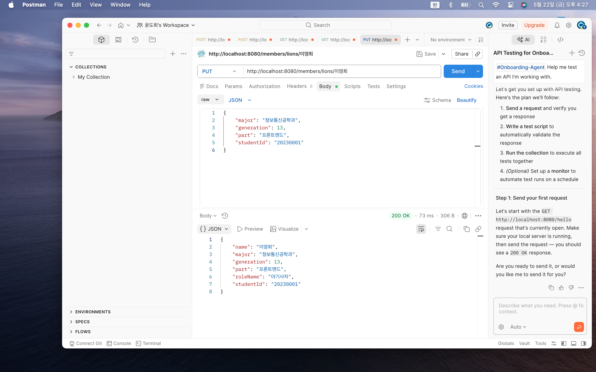
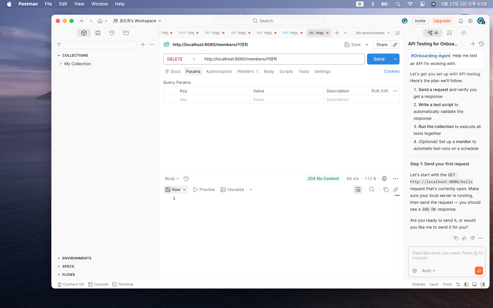

# 📘 Today I Learned

### 1. 오늘 배운 내용

공부 날짜: 26.5.22

이번 주차에서는 Spring Boot를 활용하여 멤버 관리 REST API를 직접 구현하는 실습을 진행했다.

기존에는 단순히 GET 요청만 처리하는 간단한 Controller를 작성했다면, 이번에는 실제 CRUD(Create, Read, Update, Delete) 기능을 수행하는 API를 구현하며 Spring Boot의 전반적인 흐름을 학습할 수 있었다.

먼저 Domain, DTO, Repository, Service, Controller 계층을 분리하여 프로젝트 구조를 구성하였다.
특히 역할(Role)을 기준으로 아기사자(Lion)와 운영진(Staff)을 상속 구조로 구현하면서 객체지향적인 설계 방식을 직접 적용해 볼 수 있었다.

또한 Repository에서는 메모리 기반 저장소를 구현하여 데이터를 저장하고 조회할 수 있도록 만들었고, Service 계층에서는 비즈니스 로직을 처리하도록 구성하였다.
Controller에서는 HTTP 요청을 처리하며 `POST`, `GET`, `PUT`, `DELETE` 요청을 각각 구현하였다.

이번 실습에서는 Postman을 활용해 API 테스트를 진행하였다.
JSON 형식의 Request Body를 직접 작성하여 서버에 요청을 보내고, 상태 코드(201, 200, 404, 409 등)와 응답 데이터를 확인하는 과정을 실습했다.

특히 `@RequestBody`, `@PathVariable`, `ResponseEntity` 등을 활용하면서 Spring Boot에서 HTTP 요청과 응답이 처리되는 흐름을 이해할 수 있었다.

또한 프로젝트를 하나의 링크로 제출해야 했기 때문에 기존 week6 프로젝트와 충돌이 발생하지 않도록 패키지 구조와 Bean 등록 방식도 함께 고려해야 했다.
`scanBasePackages` 설정을 통해 week7 패키지까지 스캔되도록 수정하면서 Spring Boot의 Component Scan 구조도 이해할 수 있었다.

---

### 2. 핵심 정리 (내 언어로)

* Spring Boot에서는 Controller, Service, Repository, DTO, Domain 계층을 분리하여 구조화할 수 있다.
* `@RestController`를 사용하면 REST API를 구현할 수 있다.
* `@PostMapping`, `@GetMapping`, `@PutMapping`, `@DeleteMapping`을 통해 각각의 HTTP 요청을 처리할 수 있다.
* `@RequestBody`를 사용하면 JSON 데이터를 객체로 변환할 수 있다.
* `@PathVariable`을 사용하면 URL 경로 값을 받아올 수 있다.
* `ResponseEntity`를 통해 상태 코드와 응답 데이터를 함께 반환할 수 있다.
* Repository에서는 메모리 기반 리스트를 활용하여 데이터를 저장하고 관리할 수 있다.
* Service 계층에서는 중복 검사나 수정 로직 같은 비즈니스 로직을 처리한다.
* Postman을 활용하면 다양한 HTTP 요청과 응답 결과를 테스트할 수 있다.
* Spring Boot는 패키지 구조와 Component Scan 범위가 매우 중요하다.
* `scanBasePackages`를 통해 여러 패키지를 함께 스캔할 수 있다.
* CRUD API를 구현하면서 실제 백엔드 서버의 동작 흐름을 경험할 수 있었다.

즉, 이번 실습의 핵심은 Spring Boot 기반의 REST API를 직접 설계하고 구현하면서, 계층형 구조와 CRUD 처리 흐름을 이해하는 것이었다.

---

### 3. 결과 이미지

---

### 4. 느낀 점

이번 주차에서는 단순히 API를 호출하는 수준을 넘어, 실제 CRUD 기능을 갖춘 REST API를 직접 구현해 볼 수 있었다.

처음에는 DTO와 Repository, Service, Controller 계층을 각각 나누는 구조가 익숙하지 않아서 헷갈렸지만, 역할별로 책임을 분리하는 것이 유지보수와 코드 관리 측면에서 매우 중요하다는 점을 이해할 수 있었다.

특히 아기사자와 운영진을 상속 구조로 구현하면서 객체지향 프로그래밍의 개념을 실제 프로젝트에 적용해 본 경험이 인상적이었다.
또한 HTTP 요청 방식에 따라 서로 다른 기능이 동작하고, 상태 코드가 다르게 반환되는 과정을 직접 확인하면서 REST API의 동작 원리를 조금 더 이해할 수 있었다.

이번 실습에서는 Postman을 사용해 요청 Body를 JSON 형식으로 작성하고 응답 결과를 확인했는데,
처음에는 Request Body 설정을 하지 않아 오류가 발생하기도 했다.
하지만 오류 로그를 분석하고 문제를 해결하는 과정을 통해 디버깅 경험도 함께 쌓을 수 있었다.

또한 기존 week6 프로젝트 위에서 week7 기능을 추가해야 했기 때문에 패키지 구조와 Spring Boot의 Component Scan 범위까지 고려해야 했다.
이를 통해 단순히 코드 작성뿐 아니라 프로젝트 전체 구조를 관리하는 것도 중요하다는 점을 느낄 수 있었다.

이번 실습을 통해 Spring Boot 기반 REST API 개발의 전체 흐름을 경험할 수 있었고,
앞으로는 데이터베이스 연동이나 JPA 같은 기능까지 확장해 보고 싶다는 생각이 들었다.
