# 📘 Today I Learned

### 1. 오늘 배운 내용

공부 날짜: 26.6.22

이번 실습에서는 Spring Boot 프로젝트에 전역 예외 처리(Global Exception Handling)를 도입하고, 기존 코드를 리팩토링하여 보다 유지보수하기 쉬운 구조로 개선하는 방법을 학습하였다.

이전 주차까지는 Member와 Assignment의 CRUD 기능을 구현하고 JPA 연관관계 및 트랜잭션을 적용하였다. 하지만 존재하지 않는 데이터를 조회하거나 중복된 이름으로 멤버를 등록하는 경우 Controller와 Service 계층에서 각각 예외 상황을 처리하고 있었기 때문에 코드가 중복되고 응답 형식도 통일되지 않는 문제가 있었다.

이번 실습에서는 `@RestControllerAdvice`와 `@ExceptionHandler`를 활용하여 전역 예외 처리기를 구현하였다. Member를 찾을 수 없는 경우, Assignment를 찾을 수 없는 경우, 중복된 이름으로 멤버를 등록하는 경우에 사용할 커스텀 예외 클래스를 생성하고, 예외 발생 시 일관된 JSON 형식으로 응답하도록 구현하였다.

또한 ErrorResponse DTO를 생성하여 모든 에러 응답이 동일한 형식을 가지도록 하였다. 이를 통해 Controller에서는 정상 흐름만 처리하고, 예외 상황은 전역 예외 처리기에서 담당하도록 역할을 분리하였다.

Service 계층도 리팩토링하였다. 기존에는 조회 실패 시 null을 반환하고 Controller에서 null 여부를 검사했지만, 이번 실습에서는 `orElseThrow()`를 사용하여 적절한 예외를 발생시키도록 변경하였다. 이를 통해 Service 계층이 비즈니스 로직과 예외 처리를 함께 담당하도록 개선하였다.

추가적으로 Spring Data JPA의 쿼리 메서드 기능을 활용하여 검색 API를 구현하였다. MemberRepository에는 파트별 조회 기능을, AssignmentRepository에는 제목 검색 기능을 추가하였다. `findByPart()`와 `findByTitleContaining()` 메서드를 활용하여 별도의 JPQL 작성 없이 검색 기능을 구현할 수 있었다.

마지막으로 제공된 프론트엔드 코드를 프로젝트에 연동하여 브라우저 환경에서 API를 직접 테스트하였다. 멤버 등록, 수정, 삭제, 과제 등록, 조회, 검색 등의 기능을 실제 화면에서 확인하였으며, HTTP 통신 로그 패널을 통해 요청과 응답이 오가는 과정을 관찰하였다. 또한 존재하지 않는 데이터를 조회하거나 중복 데이터를 등록하는 경우 전역 예외 처리기가 반환한 에러 응답이 토스트 알림으로 표시되는 것을 확인하였다.

이번 실습을 통해 Spring Boot에서 전역 예외 처리를 설계하는 방법과 프론트엔드-백엔드 간 HTTP 통신 구조를 이해할 수 있었다.

---

### 2. 핵심 정리 (내 언어로)

* `@RestControllerAdvice`는 모든 Controller에서 발생하는 예외를 한 곳에서 처리할 수 있게 해준다.
* `@ExceptionHandler`는 특정 예외 타입에 대한 처리 로직을 정의할 수 있다.
* 커스텀 예외를 사용하면 예외 상황을 보다 명확하게 표현할 수 있다.
* Service에서 null을 반환하는 것보다 예외를 발생시키는 방식이 책임 분리에 유리하다.
* `orElseThrow()`를 사용하면 조회 실패 시 즉시 예외를 발생시킬 수 있다.
* ErrorResponse DTO를 사용하면 모든 에러 응답 형식을 통일할 수 있다.
* Controller는 정상 요청 처리만 담당하고, 예외 처리는 전역 예외 처리기가 담당하도록 구성하는 것이 좋다.
* Spring Data JPA는 메서드 이름만으로도 검색 쿼리를 생성할 수 있다.
* `findByPart()`를 통해 파트별 멤버 조회를 구현할 수 있다.
* `findByTitleContaining()`을 통해 제목에 특정 키워드가 포함된 과제를 검색할 수 있다.
* HTTP 상태 코드는 상황에 맞게 반환해야 한다.
* 존재하지 않는 데이터 조회는 404(Not Found)를 사용한다.
* 중복 데이터 등록은 409(Conflict)를 사용한다.
* 프론트엔드에서는 fetch API를 통해 백엔드 API를 호출한다.
* 백엔드가 반환한 JSON 응답은 화면에 렌더링되거나 토스트 알림으로 사용자에게 전달된다.
* GET, POST, PUT, DELETE는 각각 조회, 생성, 수정, 삭제 CRUD 동작과 대응된다.

즉, 이번 실습의 핵심은 전역 예외 처리를 통해 코드 구조를 개선하고, 검색 API와 프론트엔드 연동을 통해 실제 서비스와 유사한 형태의 프로젝트를 구현하는 것이었다.

---

### 3. 결과 이미지

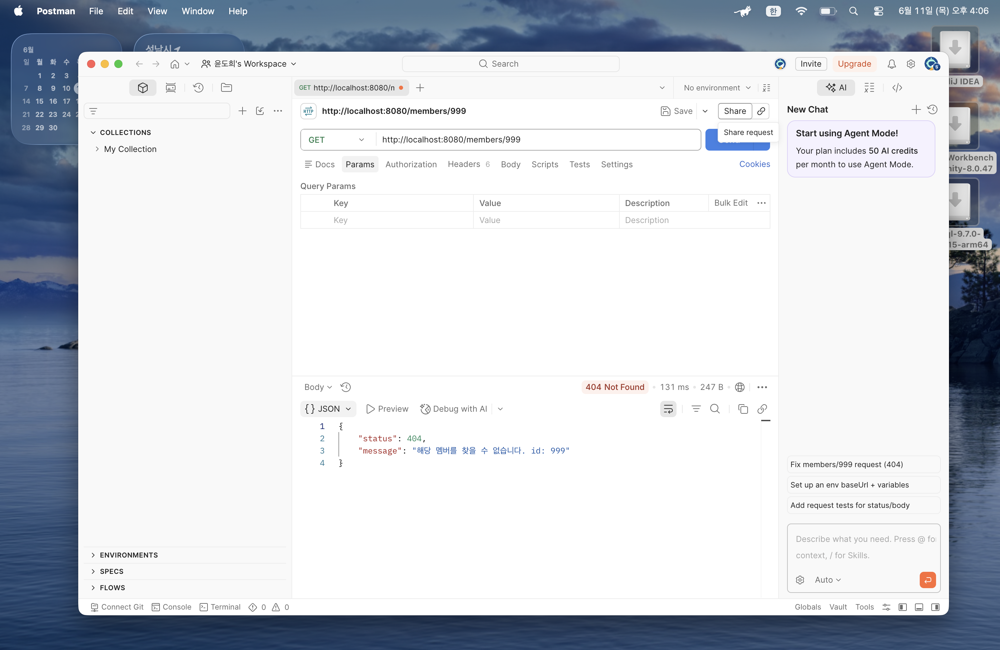
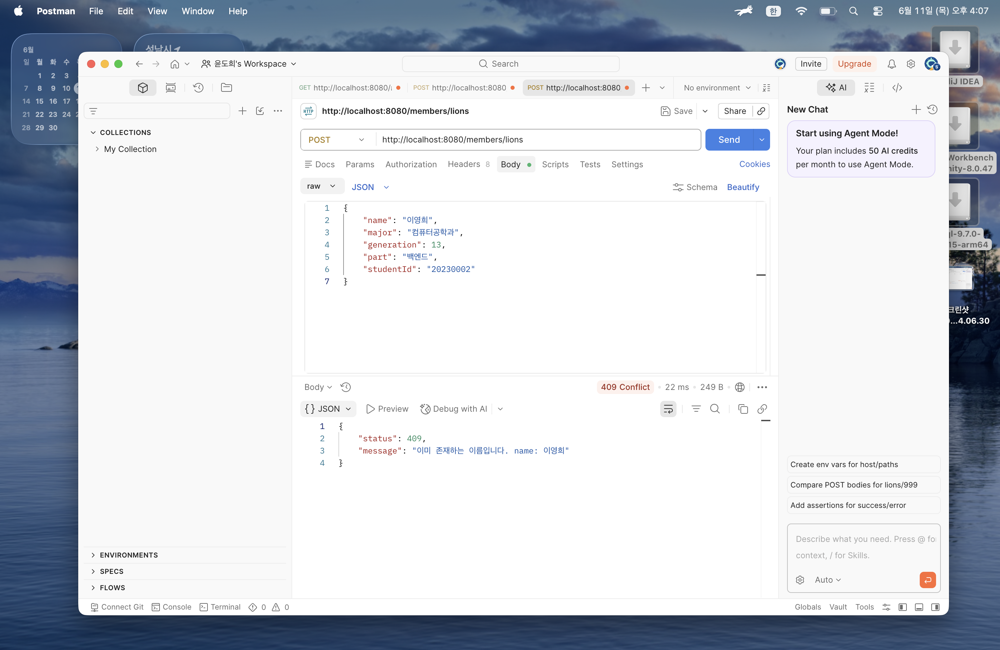
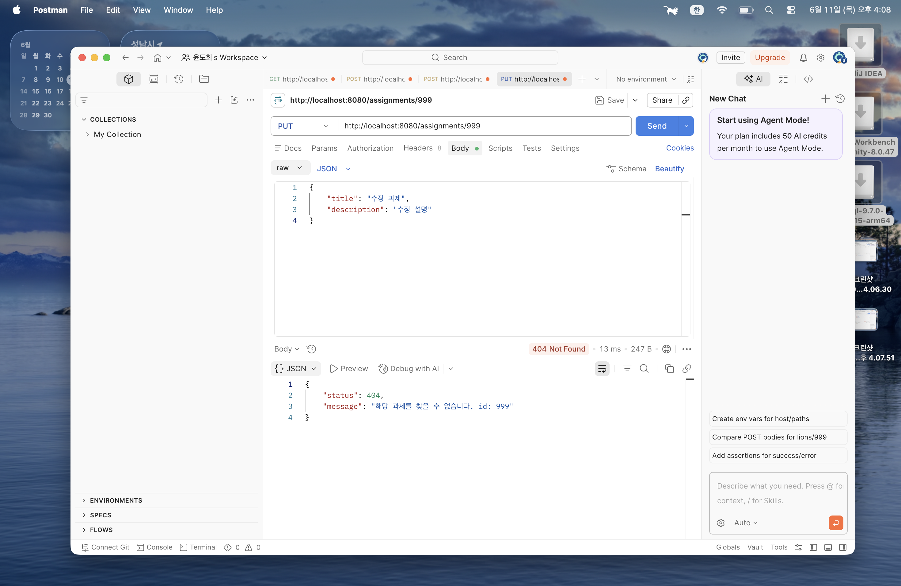
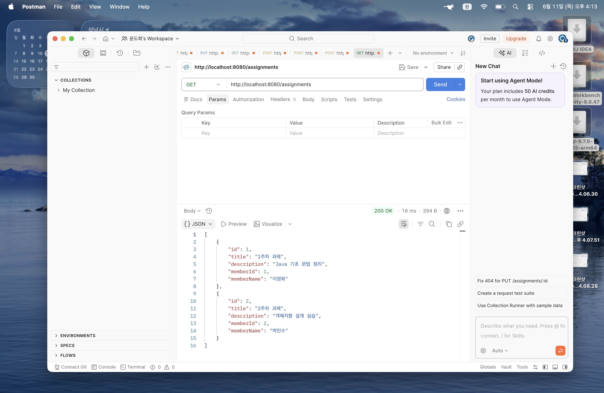
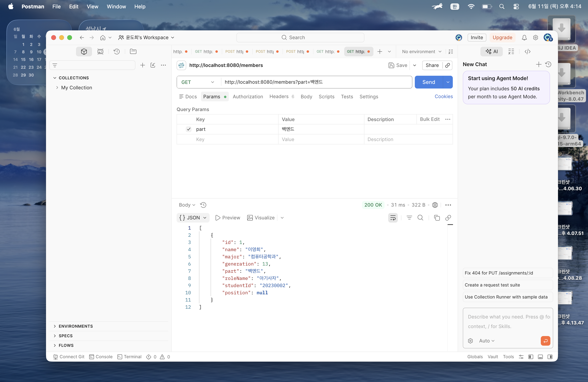

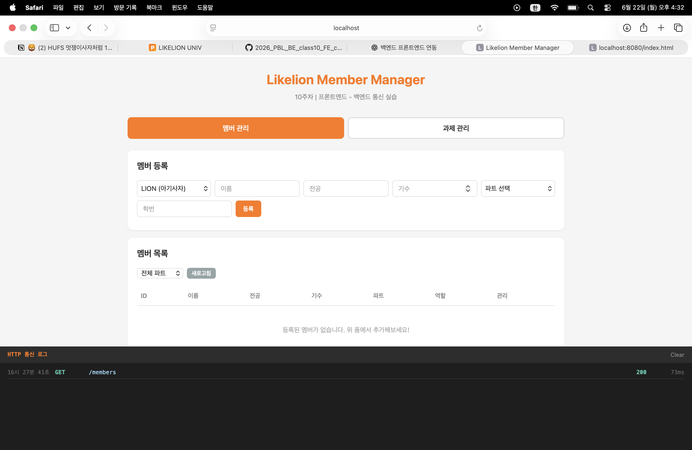
# 📘 Today I Learned

### 1. 오늘 배운 내용

공부 날짜: 26.6.22

이번 실습에서는 Spring Boot 프로젝트에 전역 예외 처리(Global Exception Handling)를 도입하고, 기존 코드를 리팩토링하여 보다 유지보수하기 쉬운 구조로 개선하는 방법을 학습하였다.

이전 주차까지는 Member와 Assignment의 CRUD 기능을 구현하고 JPA 연관관계 및 트랜잭션을 적용하였다. 하지만 존재하지 않는 데이터를 조회하거나 중복된 이름으로 멤버를 등록하는 경우 Controller와 Service 계층에서 각각 예외 상황을 처리하고 있었기 때문에 코드가 중복되고 응답 형식도 통일되지 않는 문제가 있었다.

이번 실습에서는 `@RestControllerAdvice`와 `@ExceptionHandler`를 활용하여 전역 예외 처리기를 구현하였다. Member를 찾을 수 없는 경우, Assignment를 찾을 수 없는 경우, 중복된 이름으로 멤버를 등록하는 경우에 사용할 커스텀 예외 클래스를 생성하고, 예외 발생 시 일관된 JSON 형식으로 응답하도록 구현하였다.

또한 ErrorResponse DTO를 생성하여 모든 에러 응답이 동일한 형식을 가지도록 하였다. 이를 통해 Controller에서는 정상 흐름만 처리하고, 예외 상황은 전역 예외 처리기에서 담당하도록 역할을 분리하였다.

Service 계층도 리팩토링하였다. 기존에는 조회 실패 시 null을 반환하고 Controller에서 null 여부를 검사했지만, 이번 실습에서는 `orElseThrow()`를 사용하여 적절한 예외를 발생시키도록 변경하였다. 이를 통해 Service 계층이 비즈니스 로직과 예외 처리를 함께 담당하도록 개선하였다.

추가적으로 Spring Data JPA의 쿼리 메서드 기능을 활용하여 검색 API를 구현하였다. MemberRepository에는 파트별 조회 기능을, AssignmentRepository에는 제목 검색 기능을 추가하였다. `findByPart()`와 `findByTitleContaining()` 메서드를 활용하여 별도의 JPQL 작성 없이 검색 기능을 구현할 수 있었다.

마지막으로 제공된 프론트엔드 코드를 프로젝트에 연동하여 브라우저 환경에서 API를 직접 테스트하였다. 멤버 등록, 수정, 삭제, 과제 등록, 조회, 검색 등의 기능을 실제 화면에서 확인하였으며, HTTP 통신 로그 패널을 통해 요청과 응답이 오가는 과정을 관찰하였다. 또한 존재하지 않는 데이터를 조회하거나 중복 데이터를 등록하는 경우 전역 예외 처리기가 반환한 에러 응답이 토스트 알림으로 표시되는 것을 확인하였다.

이번 실습을 통해 Spring Boot에서 전역 예외 처리를 설계하는 방법과 프론트엔드-백엔드 간 HTTP 통신 구조를 이해할 수 있었다.

---

### 2. 핵심 정리 (내 언어로)

* `@RestControllerAdvice`는 모든 Controller에서 발생하는 예외를 한 곳에서 처리할 수 있게 해준다.
* `@ExceptionHandler`는 특정 예외 타입에 대한 처리 로직을 정의할 수 있다.
* 커스텀 예외를 사용하면 예외 상황을 보다 명확하게 표현할 수 있다.
* Service에서 null을 반환하는 것보다 예외를 발생시키는 방식이 책임 분리에 유리하다.
* `orElseThrow()`를 사용하면 조회 실패 시 즉시 예외를 발생시킬 수 있다.
* ErrorResponse DTO를 사용하면 모든 에러 응답 형식을 통일할 수 있다.
* Controller는 정상 요청 처리만 담당하고, 예외 처리는 전역 예외 처리기가 담당하도록 구성하는 것이 좋다.
* Spring Data JPA는 메서드 이름만으로도 검색 쿼리를 생성할 수 있다.
* `findByPart()`를 통해 파트별 멤버 조회를 구현할 수 있다.
* `findByTitleContaining()`을 통해 제목에 특정 키워드가 포함된 과제를 검색할 수 있다.
* HTTP 상태 코드는 상황에 맞게 반환해야 한다.
* 존재하지 않는 데이터 조회는 404(Not Found)를 사용한다.
* 중복 데이터 등록은 409(Conflict)를 사용한다.
* 프론트엔드에서는 fetch API를 통해 백엔드 API를 호출한다.
* 백엔드가 반환한 JSON 응답은 화면에 렌더링되거나 토스트 알림으로 사용자에게 전달된다.
* GET, POST, PUT, DELETE는 각각 조회, 생성, 수정, 삭제 CRUD 동작과 대응된다.

즉, 이번 실습의 핵심은 전역 예외 처리를 통해 코드 구조를 개선하고, 검색 API와 프론트엔드 연동을 통해 실제 서비스와 유사한 형태의 프로젝트를 구현하는 것이었다.

---

### 3. 결과 이미지

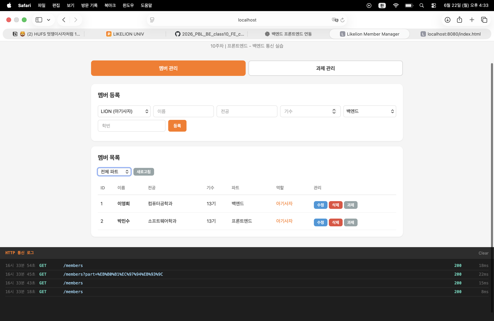
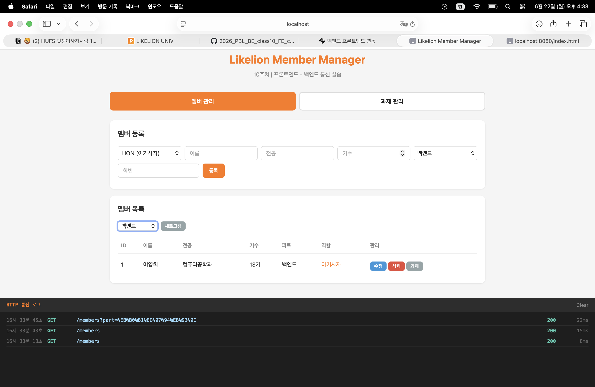
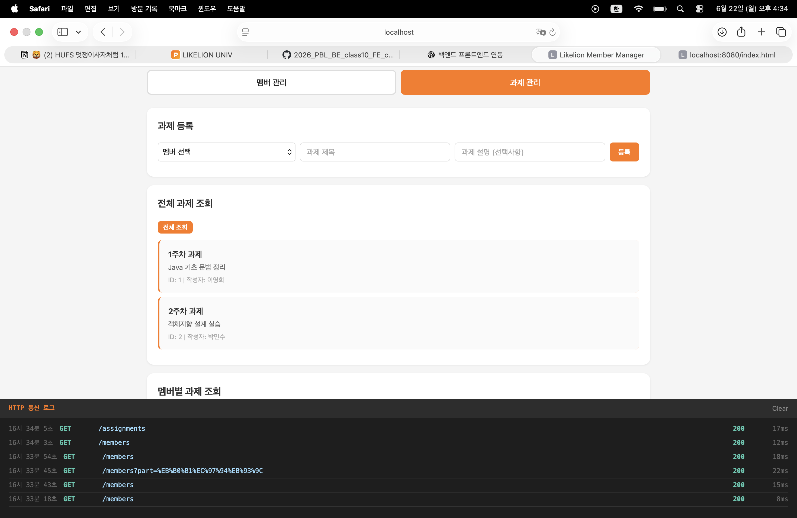
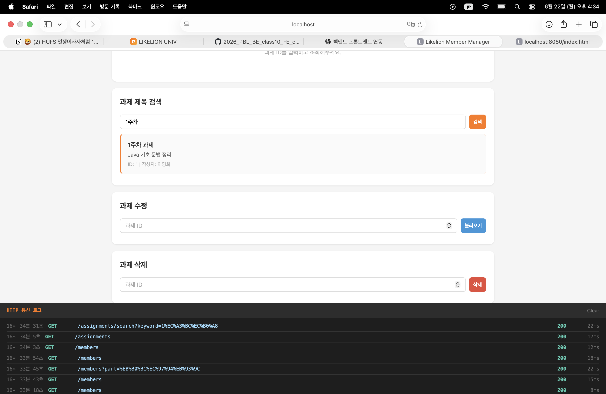
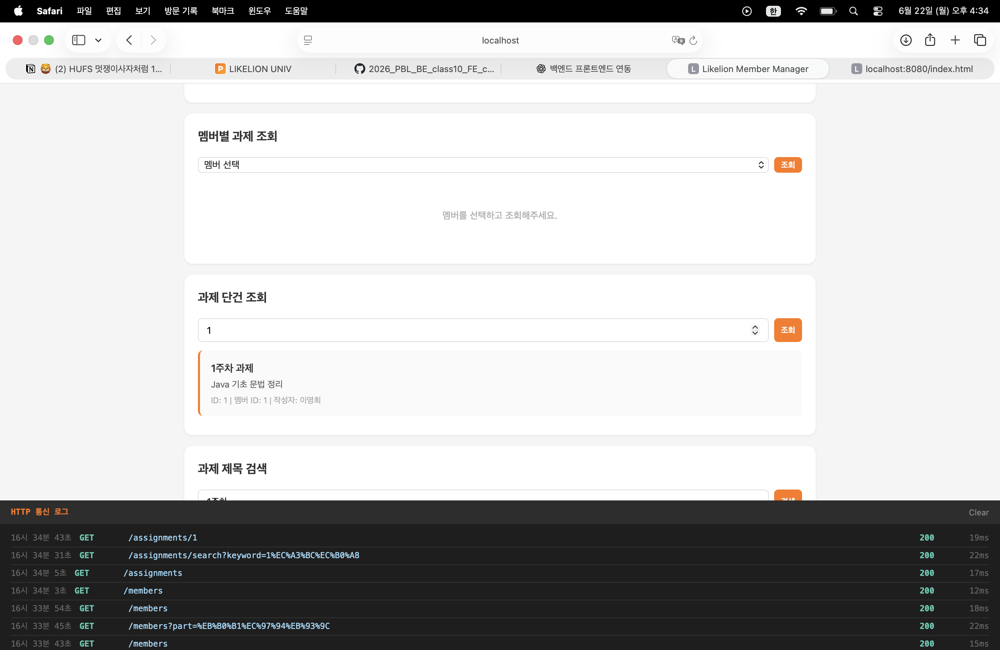
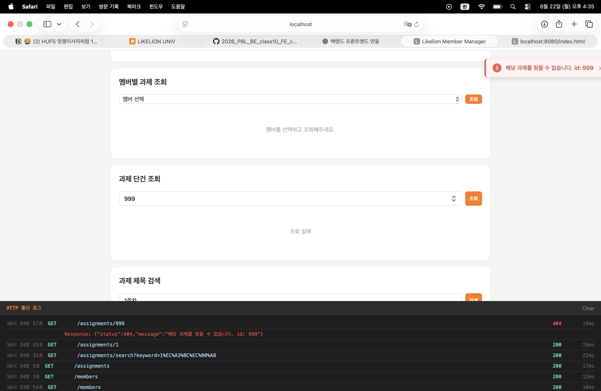
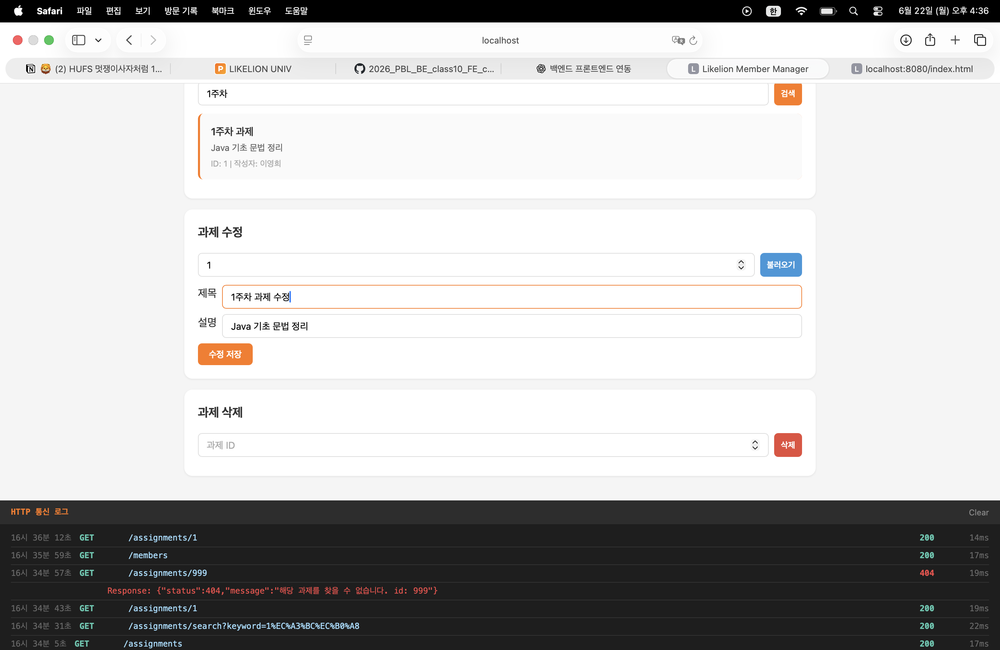
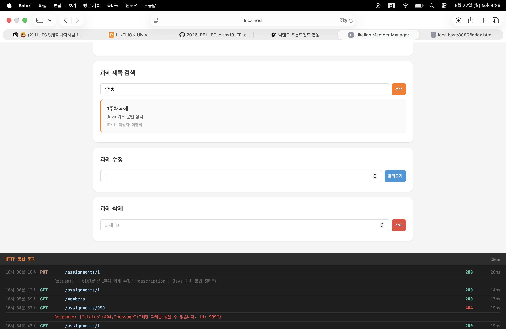
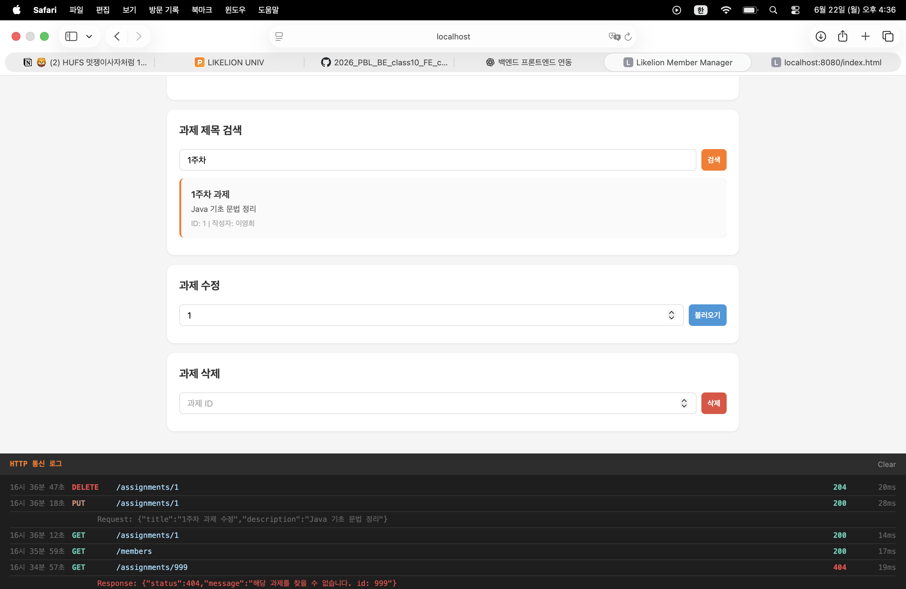

---

### 4. 느낀 점

이번 실습에서는 단순히 기능을 구현하는 것을 넘어 프로젝트 구조를 개선하는 경험을 할 수 있었다.

이전까지는 Controller와 Service에서 각각 예외 상황을 처리하고 있었기 때문에 코드가 중복되고 관리가 어려웠다. 하지만 `@RestControllerAdvice`를 적용하면서 예외 처리 로직을 한 곳으로 모을 수 있었고, 각 계층이 담당해야 할 역할이 더욱 명확해졌다.

특히 Service에서 null을 반환하는 방식 대신 예외를 발생시키는 방식으로 변경하면서 비즈니스 로직과 예외 처리의 관계를 이해할 수 있었다. 또한 ErrorResponse를 통해 모든 에러 응답 형식을 통일하니 프론트엔드에서도 일관성 있게 에러를 처리할 수 있다는 점이 인상적이었다.

Spring Data JPA의 쿼리 메서드 기능도 흥미로웠다. 별도의 SQL이나 JPQL을 작성하지 않고도 메서드 이름만으로 검색 기능을 구현할 수 있다는 점이 매우 편리하게 느껴졌다.

이번 실습에서 가장 인상적이었던 부분은 프론트엔드와의 연동이었다. 이전에는 Postman으로만 API를 테스트했지만, 실제 브라우저 화면에서 데이터를 입력하고 결과를 확인하면서 사용자의 입장에서 애플리케이션이 동작하는 과정을 경험할 수 있었다. 또한 HTTP 통신 로그를 통해 요청과 응답의 흐름을 직접 확인하면서 REST API의 동작 방식을 더욱 명확하게 이해할 수 있었다.

이번 실습을 통해 전역 예외 처리와 API 설계의 중요성을 이해할 수 있었으며, 앞으로는 인증/인가, JWT, Spring Security와 같은 보다 실무적인 기능도 학습해 보고 싶다는 생각이 들었다.

---

### 4. 느낀 점

이번 실습에서는 단순히 기능을 구현하는 것을 넘어 프로젝트 구조를 개선하는 경험을 할 수 있었다.

이전까지는 Controller와 Service에서 각각 예외 상황을 처리하고 있었기 때문에 코드가 중복되고 관리가 어려웠다. 하지만 `@RestControllerAdvice`를 적용하면서 예외 처리 로직을 한 곳으로 모을 수 있었고, 각 계층이 담당해야 할 역할이 더욱 명확해졌다.

특히 Service에서 null을 반환하는 방식 대신 예외를 발생시키는 방식으로 변경하면서 비즈니스 로직과 예외 처리의 관계를 이해할 수 있었다. 또한 ErrorResponse를 통해 모든 에러 응답 형식을 통일하니 프론트엔드에서도 일관성 있게 에러를 처리할 수 있다는 점이 인상적이었다.

Spring Data JPA의 쿼리 메서드 기능도 흥미로웠다. 별도의 SQL이나 JPQL을 작성하지 않고도 메서드 이름만으로 검색 기능을 구현할 수 있다는 점이 매우 편리하게 느껴졌다.

이번 실습에서 가장 인상적이었던 부분은 프론트엔드와의 연동이었다. 이전에는 Postman으로만 API를 테스트했지만, 실제 브라우저 화면에서 데이터를 입력하고 결과를 확인하면서 사용자의 입장에서 애플리케이션이 동작하는 과정을 경험할 수 있었다. 또한 HTTP 통신 로그를 통해 요청과 응답의 흐름을 직접 확인하면서 REST API의 동작 방식을 더욱 명확하게 이해할 수 있었다.

이번 실습을 통해 전역 예외 처리와 API 설계의 중요성을 이해할 수 있었으며, 앞으로는 인증/인가, JWT, Spring Security와 같은 보다 실무적인 기능도 학습해 보고 싶다는 생각이 들었다.
