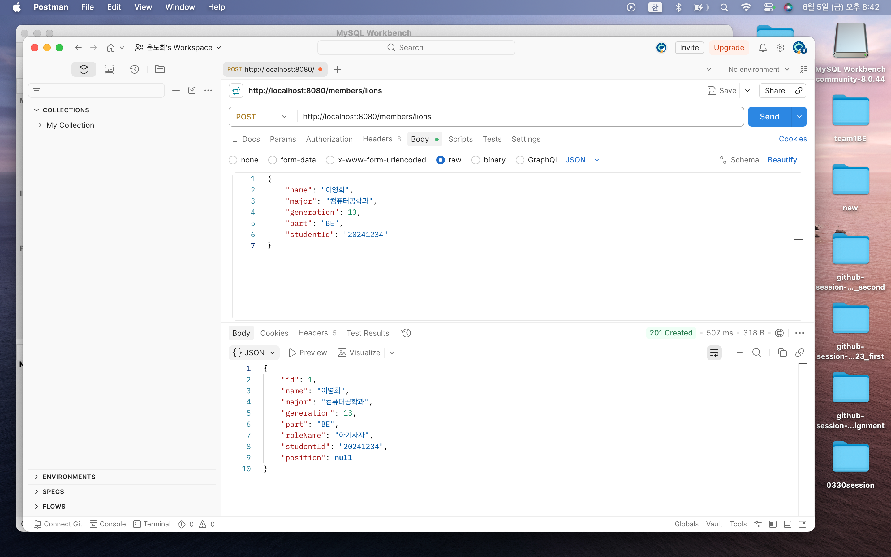
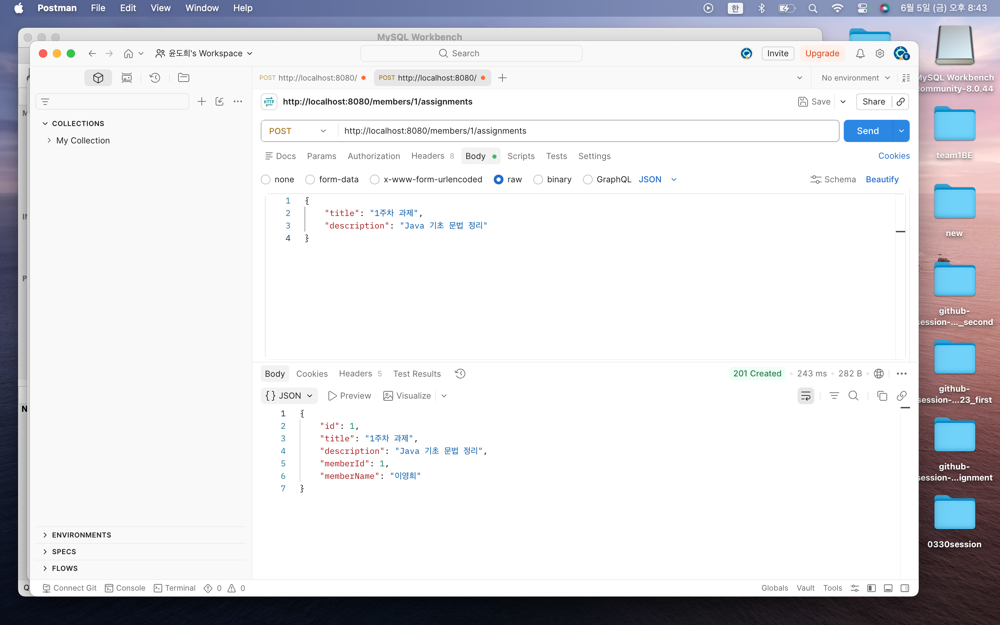
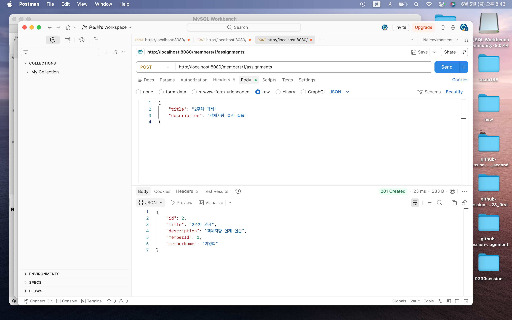
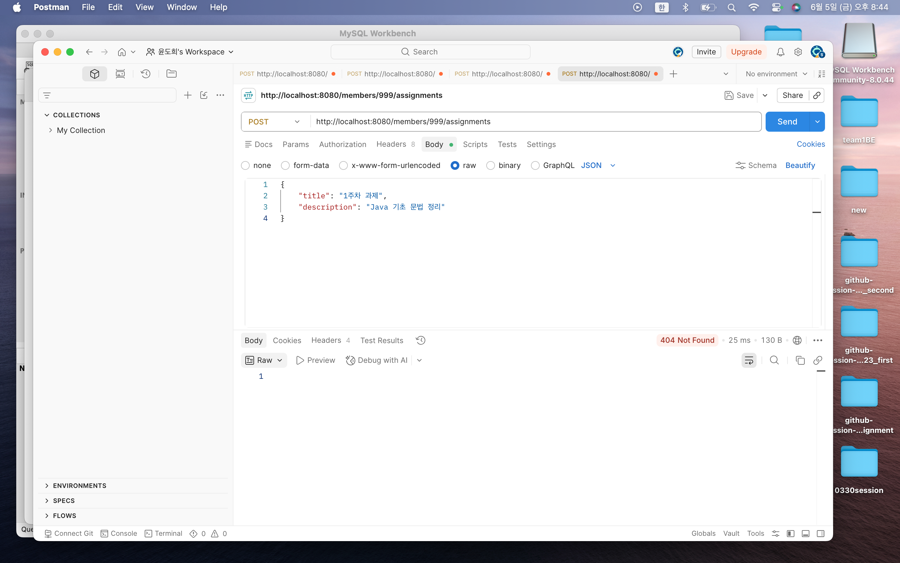
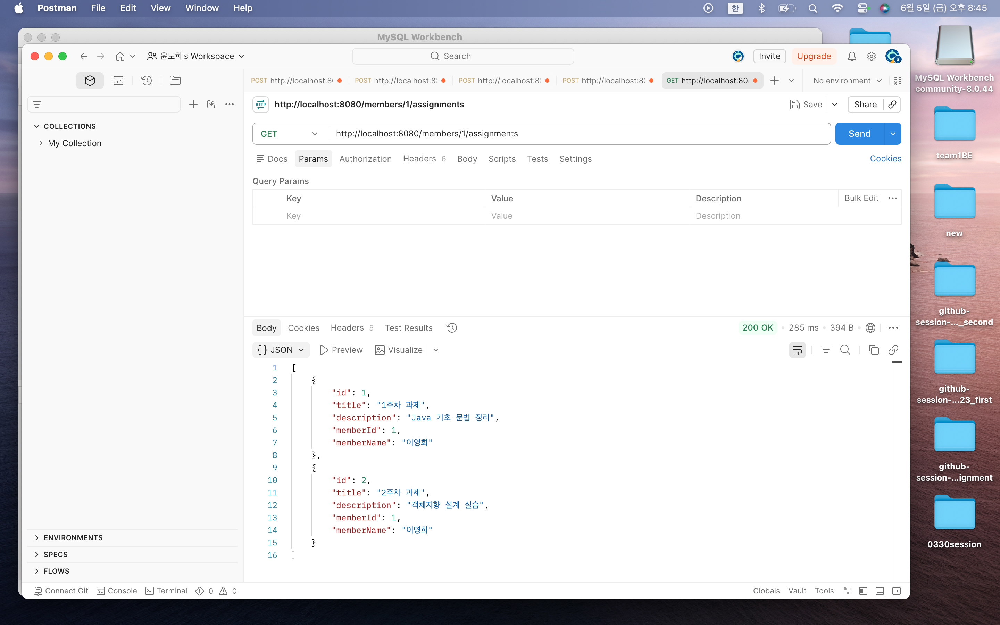
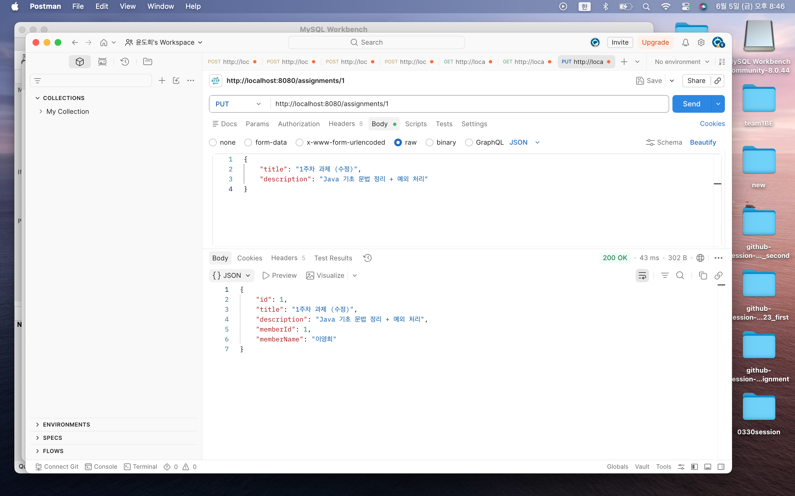
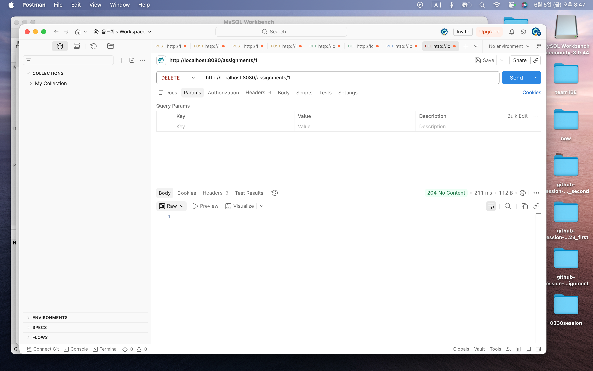
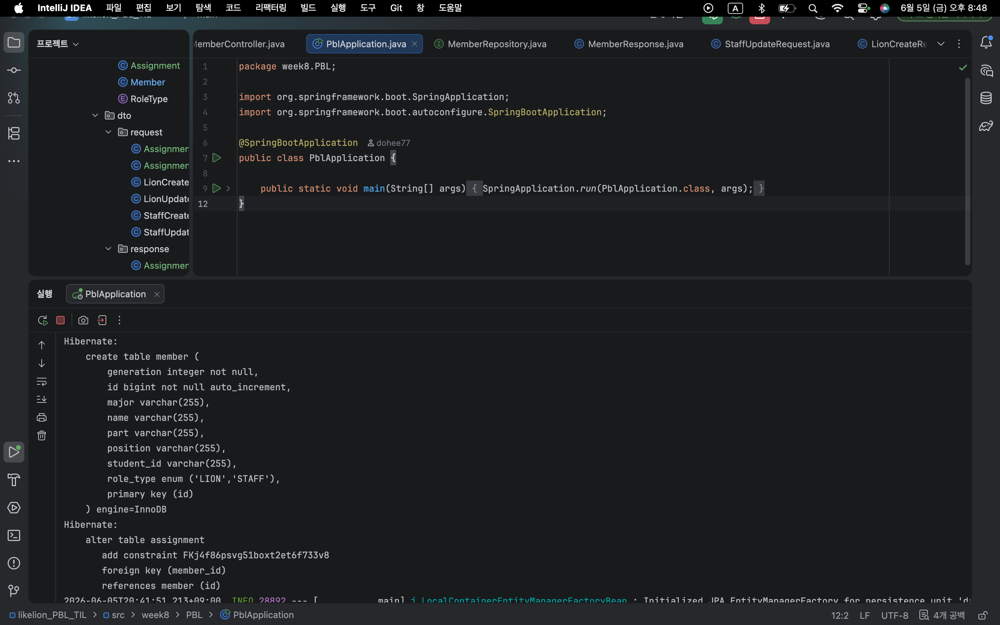
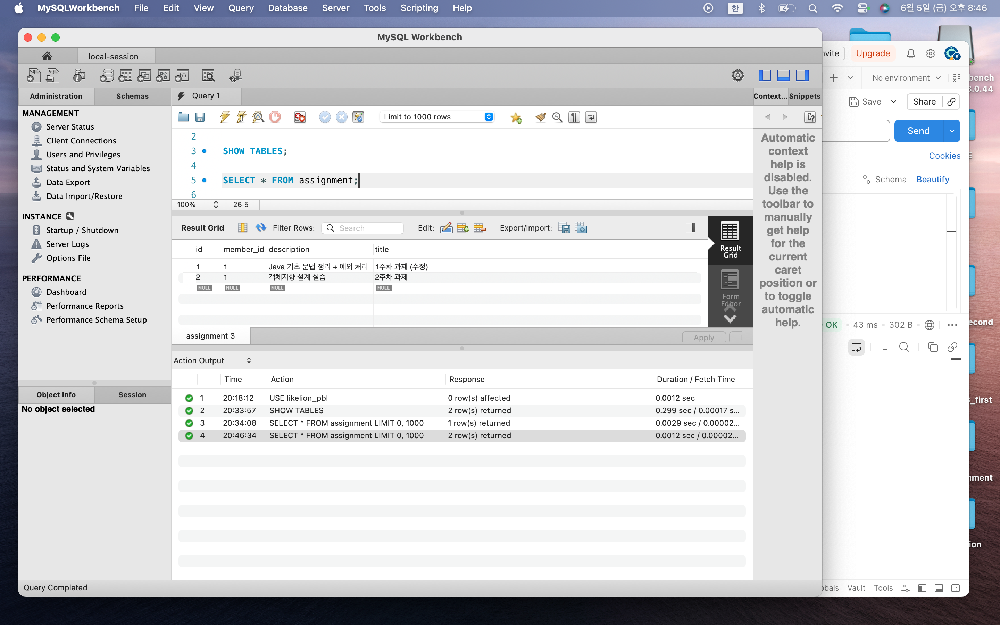
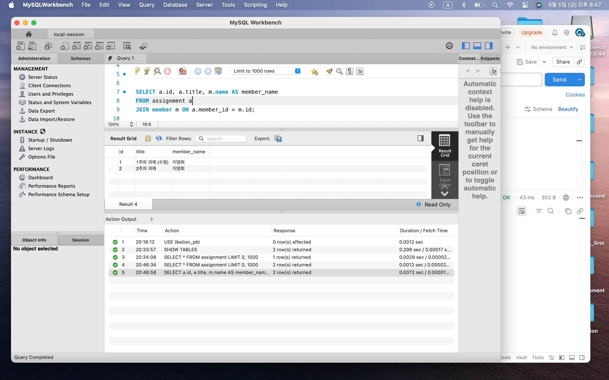

# 📘 Today I Learned

### 1. 오늘 배운 내용

공부 날짜: 26.6.5

이번 실습에서는 Spring Boot와 JPA를 활용하여 Member와 Assignment 사이의 연관관계를 설계하고, 트랜잭션을 적용하여 데이터의 일관성을 보장하는 방법을 학습하였다.

이전 주차에서는 Member 엔티티만을 대상으로 CRUD 기능을 구현하였다면, 이번에는 Assignment 엔티티를 새롭게 추가하여 한 명의 Member가 여러 개의 Assignment를 가질 수 있는 1:N 관계를 구현하였다. 이를 위해 JPA의 `@ManyToOne`, `@OneToMany`, `@JoinColumn`, `mappedBy`를 활용하여 객체 간 관계를 데이터베이스의 외래 키(Foreign Key)와 연결하였다.

Assignment 엔티티에서는 `@ManyToOne`을 사용하여 하나의 Assignment가 하나의 Member에 속하도록 설계하였고, Member 엔티티에서는 `@OneToMany(mappedBy = "member")`를 사용하여 자신이 가진 Assignment 목록을 조회할 수 있도록 양방향 연관관계를 설정하였다.

또한 AssignmentRepository를 생성하여 JPA Repository를 활용한 CRUD 기능을 구현하였으며, `findByMemberId()` 메서드를 통해 특정 멤버의 과제 목록을 조회할 수 있도록 하였다.

Service 계층에서는 `@Transactional`을 적용하여 데이터 변경 작업을 하나의 트랜잭션으로 관리하였다. 클래스 레벨에는 `@Transactional(readOnly = true)`를 적용하여 조회 성능을 최적화하였고, 등록·수정·삭제와 같은 데이터 변경 작업에는 별도의 `@Transactional`을 적용하였다.

Controller에서는 Assignment 등록, 조회, 수정, 삭제 API를 구현하였으며, Postman을 이용하여 각 API의 정상 동작 여부를 검증하였다. 또한 MySQL Workbench를 통해 assignment 테이블이 생성된 것을 확인하고, member_id 외래 키가 정상적으로 저장되는 것을 확인하였다.

이번 실습을 통해 JPA의 연관관계 매핑과 트랜잭션 관리의 중요성을 이해할 수 있었으며, 객체 중심 설계와 데이터베이스 설계를 연결하는 방법을 학습할 수 있었다.

---

### 2. 핵심 정리 (내 언어로)

* JPA에서는 `@ManyToOne`, `@OneToMany`를 사용하여 엔티티 간 관계를 표현한다.
* Member와 Assignment는 1:N 관계이다.
* 외래 키(Foreign Key)는 항상 N쪽 테이블에 생성된다.
* 이번 실습에서는 assignment 테이블에 `member_id` 컬럼이 생성되었다.
* 연관관계의 주인은 외래 키를 관리하는 쪽이며, 이번에는 Assignment가 연관관계의 주인이다.
* `@JoinColumn(name = "member_id")`는 외래 키 컬럼명을 지정한다.
* `mappedBy = "member"`는 Member가 연관관계의 주인이 아님을 의미한다.
* JPA Repository를 활용하면 기본 CRUD 기능을 쉽게 구현할 수 있다.
* `findByMemberId()`와 같은 메서드 이름 기반 쿼리를 사용할 수 있다.
* `@Transactional`은 여러 데이터 변경 작업을 하나의 작업 단위로 묶어준다.
* 작업 도중 오류가 발생하면 트랜잭션 전체가 롤백된다.
* `@Transactional(readOnly = true)`는 조회 전용 트랜잭션으로 성능 최적화에 도움이 된다.
* Service 계층에 트랜잭션을 적용하는 것이 일반적인 Spring Boot 개발 패턴이다.
* Postman을 통해 REST API를 검증할 수 있다.
* MySQL Workbench를 통해 외래 키와 연관관계가 실제 DB에 반영된 것을 확인할 수 있다.

즉, 이번 실습의 핵심은 JPA의 연관관계 매핑을 통해 객체 간 관계를 설계하고, 트랜잭션을 적용하여 데이터의 일관성을 보장하는 것이었다.

---

### 3. 결과 이미지

---

### 4. 느낀 점

이번 실습에서는 단순한 CRUD 구현을 넘어 엔티티 간의 관계를 설계하는 경험을 할 수 있었다.

처음에는 `@ManyToOne`, `@OneToMany`, `mappedBy`의 역할이 헷갈렸지만, 실제로 Assignment와 Member를 연결해 보면서 연관관계의 주인이 무엇인지 이해할 수 있었다. 특히 객체에서는 양방향으로 연결되어 있지만 데이터베이스에서는 외래 키 하나로 관계가 표현된다는 점이 인상적이었다.

또한 `@Transactional`을 적용하면서 서비스 계층이 왜 중요한지 이해할 수 있었다. 이전에는 단순히 CRUD 기능만 구현했지만, 실제 서비스에서는 여러 데이터 작업을 하나의 단위로 처리해야 하며, 오류 발생 시 롤백을 통해 데이터의 일관성을 보장해야 한다는 점을 알게 되었다.

Postman을 이용한 API 테스트 과정에서는 멤버 등록, 과제 등록, 과제 조회, 수정, 삭제 과정을 직접 확인할 수 있었고, MySQL Workbench를 통해 assignment 테이블과 외래 키가 정상적으로 생성된 것도 확인할 수 있었다.

이번 실습을 통해 JPA의 연관관계 매핑과 트랜잭션 관리의 기본 개념을 익힐 수 있었으며, 앞으로는 예외 처리, 인증/인가, 지연 로딩과 같은 보다 실무적인 기능도 학습해 보고 싶다는 생각이 들었다.
