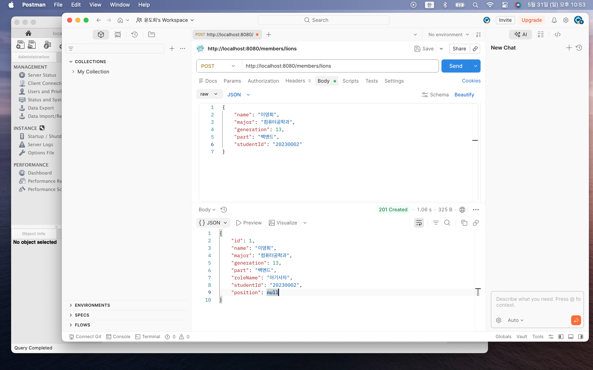
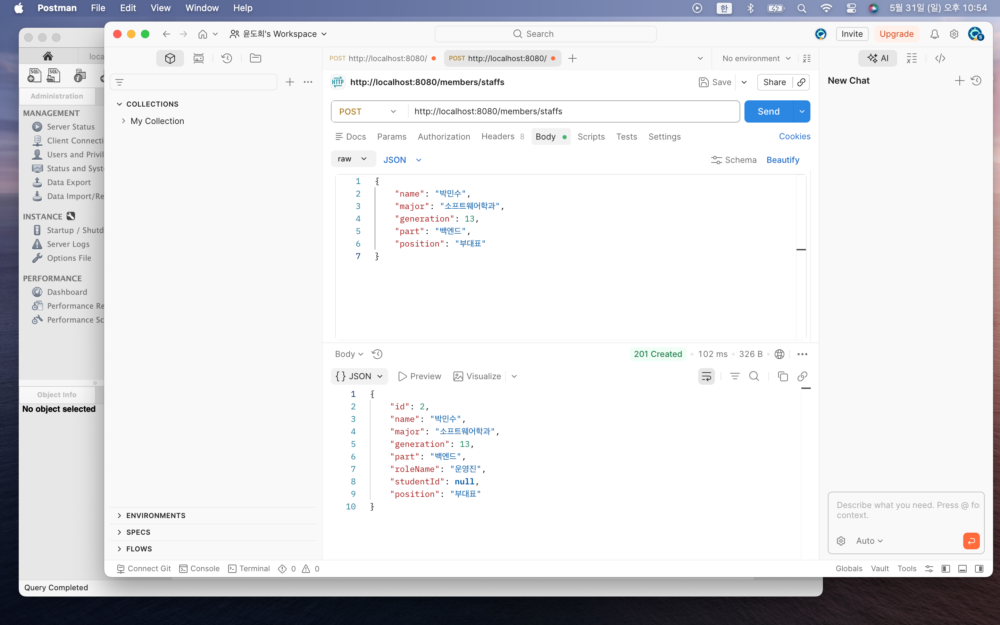
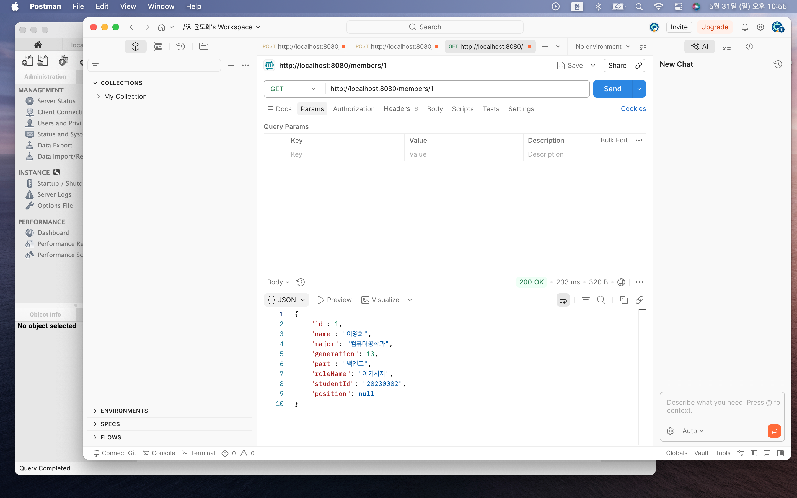
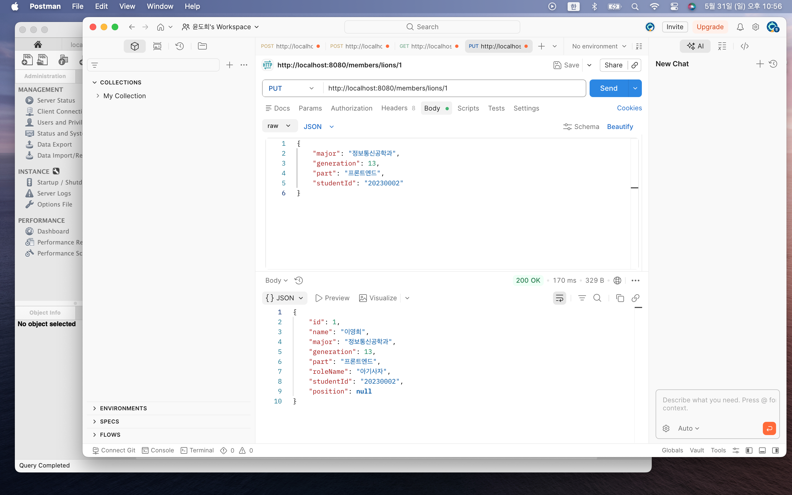
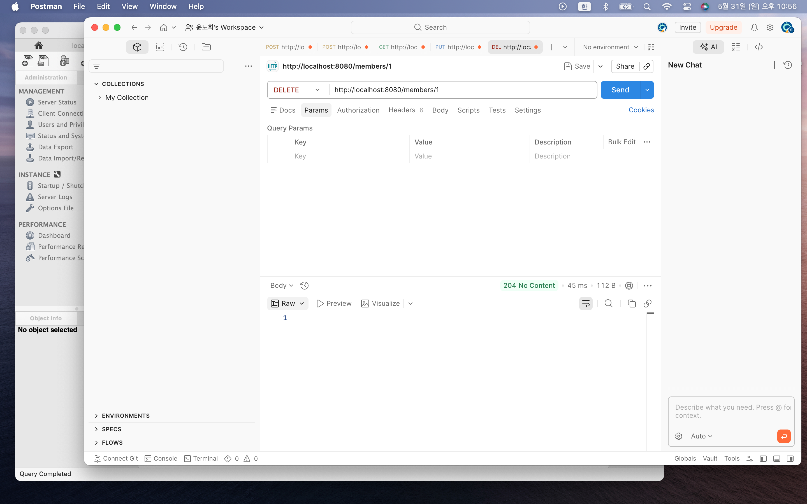
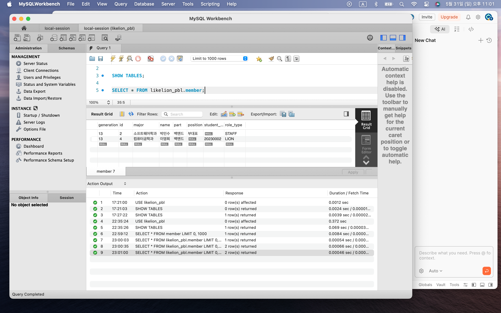
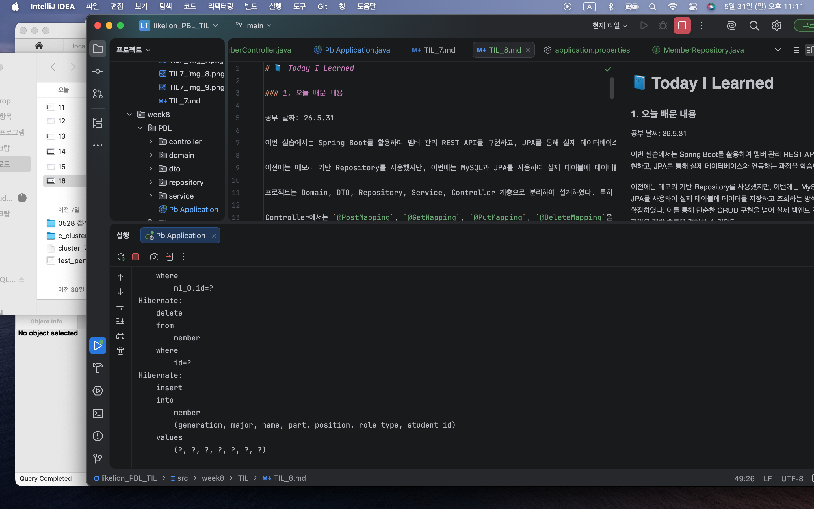

# 📘 Today I Learned

### 1. 오늘 배운 내용

공부 날짜: 26.5.31

이번 실습에서는 Spring Boot를 활용하여 멤버 관리 REST API를 구현하고, JPA를 통해 실제 데이터베이스와 연동하는 과정을 학습했다.

이전에는 메모리 기반 Repository를 사용했지만, 이번에는 MySQL과 JPA를 사용하여 실제 테이블에 데이터를 저장하고 조회하는 방식으로 확장하였다. 이를 통해 단순한 CRUD 구현을 넘어 실제 백엔드 구조에 가까운 개발 흐름을 경험할 수 있었다.

프로젝트는 Domain, DTO, Repository, Service, Controller 계층으로 분리하여 설계하였다. 특히 Member 엔티티를 중심으로 Lion과 Staff 역할을 구분하여 객체지향적인 구조를 유지하였다.

Controller에서는 `@PostMapping`, `@GetMapping`, `@PutMapping`, `@DeleteMapping`을 사용하여 CRUD API를 구성하였고, `@RequestBody`, `@PathVariable`, `ResponseEntity`를 활용하여 요청과 응답을 처리하였다.

또한 Spring Boot 실행 과정에서 패키지 구조와 Component Scan 범위가 매우 중요하다는 것을 직접 경험하였다. 메인 클래스 위치와 `scanBasePackages` 설정 때문에 Controller가 인식되지 않아 404 오류가 발생했으며, 프로젝트 패키지를 week8ㅣ9 기준으로 통일하여 해결하였다.

추가적으로 JPA 실행 시 SQL 로그를 확인하기 위해 `spring.jpa.show-sql`, `hibernate.format_sql`, logging level 설정을 적용하여 실제 실행되는 SQL을 콘솔에서 확인할 수 있었다.

Postman을 활용하여 API 테스트를 진행하면서 JSON Request Body 작성 및 응답 상태 코드(201, 200, 404 등)를 확인하였다.

---

### 2. 핵심 정리 (내 언어로)

- Spring Boot는 Controller, Service, Repository, Domain, DTO 계층으로 구조화된다.
- REST API는 `@RestController`로 구현한다.
- `@PostMapping`, `@GetMapping`, `@PutMapping`, `@DeleteMapping`으로 CRUD를 처리한다.
- `@RequestBody`는 JSON → 객체 변환 역할을 한다.
- `@PathVariable`은 URL 값을 받아온다.
- `ResponseEntity`로 상태 코드와 응답 데이터를 함께 반환한다.
- JPA를 통해 MySQL과 연동하여 실제 데이터를 저장/조회할 수 있다.
- Entity 기반 설계를 통해 객체와 테이블을 매핑한다.
- Spring Boot는 패키지 구조와 Component Scan 범위가 매우 중요하다.
- 메인 클래스 위치가 전체 프로젝트 구조에 영향을 준다.
- SQL 로그 설정으로 JPA 실행 쿼리를 확인할 수 있다.
- Postman으로 API 테스트를 수행할 수 있다.

즉, 이번 실습의 핵심은 Spring Boot + JPA 기반 REST API를 설계하고 계층 구조와 실행 흐름을 이해하는 것이었다.

---

### 3. 결과 이미지

---

### 4. 느낀 점

이번 실습에서는 단순 CRUD를 넘어 JPA를 활용하여 실제 데이터베이스와 연동하는 경험을 할 수 있었다.

Entity와 Repository 구조를 처음 접하면서 헷갈리는 부분이 있었지만, 계층별 역할을 분리하면서 전체 흐름을 이해할 수 있었다.

특히 Controller가 인식되지 않아 404 오류가 발생했던 문제는 패키지 구조와 Component Scan 범위 문제였고, 프로젝트를 week8ㅣ9 기준으로 통일하면서 해결하였다. 이를 통해 Spring Boot에서 프로젝트 구조가 얼마나 중요한지 체감할 수 있었다.

또한 SQL 로그를 통해 JPA가 실행하는 실제 SQL을 확인하면서 내부 동작 원리를 이해할 수 있었다.

Postman을 활용한 테스트 과정에서도 요청과 응답 구조를 직접 확인하며 REST API 흐름을 더 명확하게 이해할 수 있었다.

이번 실습을 통해 Spring Boot와 JPA 기반 백엔드 개발 전체 흐름을 경험할 수 있었고, 앞으로는 인증/인가 및 예외 처리까지 확장해 보고 싶다는 생각이 들었다.